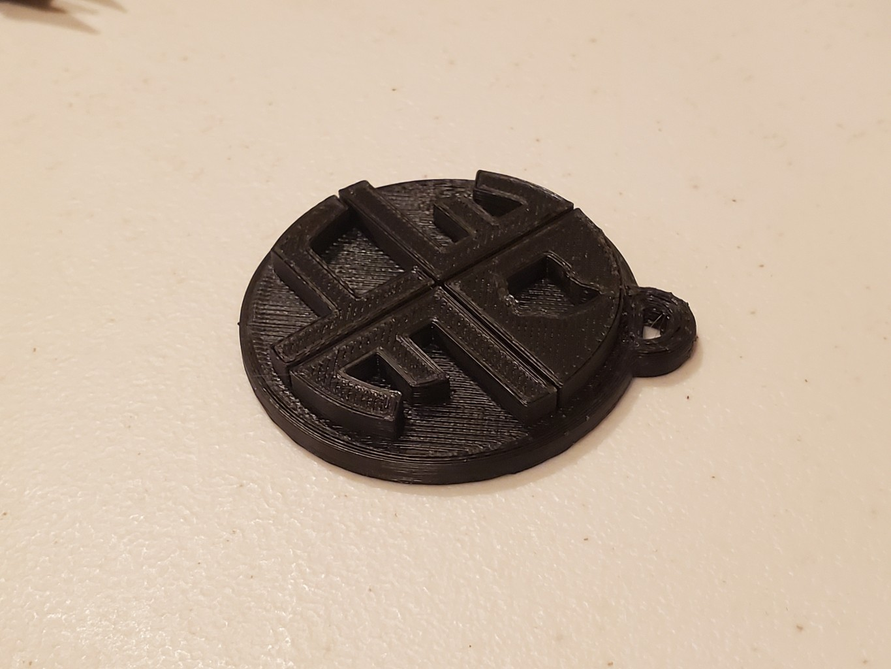

# UA 3D4E Keychain
Keychain for 3D4E club at the University of Akron.

*From [Thingiverse](https://www.thingiverse.com/thing:6117305):*
## Summary
This is a keychain I designed for the 3D4E (3D For Everyone) club at the University of Akron, intended for promoting the club. It was designed in Solidworks, and the design file can be found at my Github repository for it.

The design should be fairly straightforward to print, although the model will import to slicers standing up, it is recommended to print it laying down, with the flat side down.

*Disclaimer: I do not claim to own the rights to the 3D4E logo, and this is being shared for purely non-commercial purposes*

## Print Settings
Printer brand:
Creality

Printer:
Ender 3 Pro

Rafts:
No

Supports:
No

Resolution:
0.2mm

Infill:
20%

Filament brand:
Microcenter

Filament color:
Black

Filament material:
PLA+
